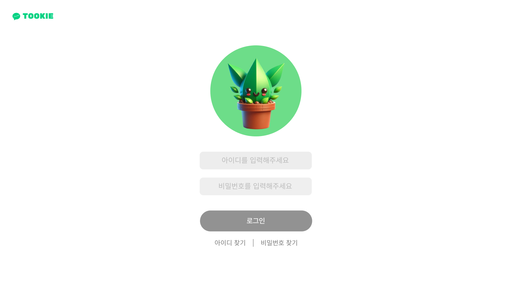

# Ama-Get-Don

## UI 개요

### 사용자 흐름 (User Flow)

이 프로젝트의 사용자 흐름은 사용자가 애플리케이션을 시작하여 챗봇과 상호 작용하는 데 있어 매끄러운 경험을 제공하도록 설계되었습니다. 주요 단계는 다음과 같습니다:

1. **시작**: 사용자는 애플리케이션을 시작하며 로그인 또는 회원가입 중 하나를 선택할 수 있습니다.
2. **회원가입 과정**: 사용자가 회원가입을 선택하면 다음의 단계를 거칩니다:
   - 약관에 동의.
   - 개인정보 입력.
   - 두 개의 설문 조사(지식 수준과 투자 상황)를 완료.
   - 완료 후 챗봇 인터페이스로 이동.
3. **챗봇 상호작용**: 사용자는 챗봇과 상호작용하여 다음을 수행할 수 있습니다:
   - 추천 질문을 통해 챗봇과 대화.
   - 메시지를 입력하여 추가 질문.
   - 개인정보를 확인 및 수정.
   - 로그아웃 또는 캐릭터 성장 단계를 직접 변경.

### UI 구성 요소

이 프로젝트에는 사용자 경험을 개선하기 위해 각각의 특정 기능을 가진 다양한 UI 구성 요소가 포함되어 있습니다:

#### 주요 페이지
1. **메인 페이지**
   - 로그인 또는 회원가입 옵션이 있는 메인 랜딩 페이지.
   - 깔끔하고 최소한의 디자인으로 사용자가 다음 단계로 쉽게 진행할 수 있도록 유도.

2. **로그인 페이지**
   - 기존 사용자를 위한 간단하고 직관적인 로그인 인터페이스.

3. **회원가입 페이지**
   - **약관 동의**: 사용자는 약관에 동의해야 합니다.
   - **개인정보 입력**: 사용자가 개인 정보를 입력합니다.
   - **설문조사**: 사용자의 지식 수준과 투자 상황에 대한 두 가지 설문조사를 진행합니다.

#### 챗봇 인터페이스
1. **챗봇 채팅 페이지**
   - 사용자가 챗봇과 상호작용할 수 있는 핵심 인터페이스.
   - 사용자 지식 수준에 따라 추천 질문이 제시됩니다.
   - 챗봇이 사용자의 입력에 따라 응답하고 추가적인 안내를 제공합니다.

#### 프로필 및 설정
1. **내 정보 관리**
   - 사용자는 자신의 개인정보를 확인하고 수정할 수 있습니다.
   - 사용자는 인터페이스를 통해 캐릭터의 성장 단계를 직접 변경할 수 있어, 개인화된 경험을 제공합니다.

### UI 디자인

이 프로젝트의 UI는 사용자 참여와 사용 편의성을 강조하여 설계되었습니다. 디자인은 일관된 테마와 생동감 있는 비주얼로 구성되어 있어, 친근하고 기능적인 화면을 제공합니다. 각 화면은 다음과 같은 원칙에 따라 설계되었습니다:

- **일관성**: 모든 페이지에 걸쳐 색상, 폰트 및 레이아웃의 일관성을 유지합니다.
- **명확성**: 사용자가 각 단계를 쉽게 이해할 수 있도록 명확하고 간결한 텍스트를 제공합니다.
- **상호작용성**: 버튼과 입력 필드 같은 상호작용 요소들이 반응성이 높고 직관적으로 설계되었습니다.
- **안내성**: 사용자가 자연스럽게 다음 단계로 이동할 수 있도록 흐름이 설계되어 혼란을 최소화합니다.

### 스크린샷

다음은 주요 인터페이스의 스크린샷입니다:

1. **메인 페이지**: 
2. **로그인 페이지**: 
3. **회원가입 페이지**: 
   
   
4. **챗봇 채팅 페이지**: 
   
5. **내 정보 페이지**: 

