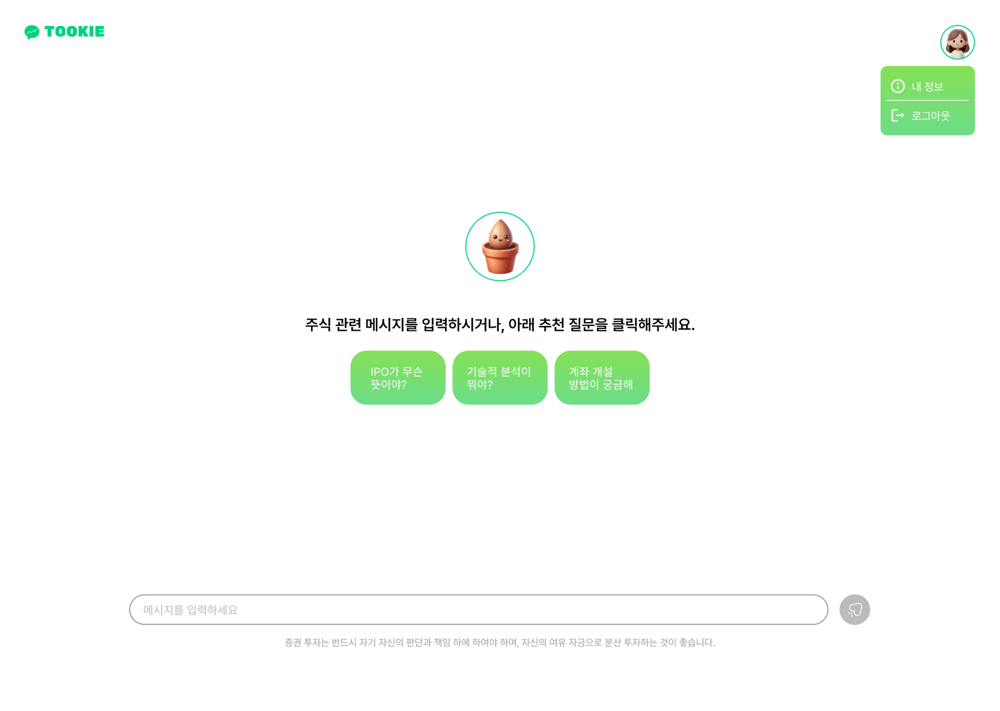
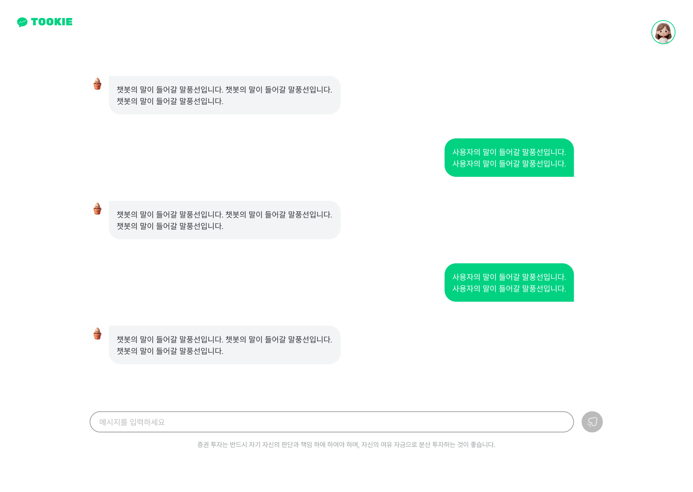

## Tookie | 투자자 데이터 기반 AI 챗봇

> 투키(Tookie)는 투자자의 데이터를 기반으로 주식투자와 관련한 질문에 답변을 제공하는 AI 챗봇 서비스 입니다. 투키는 투자자의 투자성향을 바탕으로 답변을 제공할 수 있습니다.

### 팀원 소개 및 역할

### Tookie 캐릭터
- **씨앗 -> 새순 -> 투키**

### 사용자 흐름 (User-Flow)
사용자의 흐름은 다음과 같습니다.

1. **시작**: 사용자는 애플리케이션을 시작하며 로그인 또는 회원가입 중 하나를 선택할 수 있습니다.
2. **회원가입 과정**: 사용자가 회원가입을 선택하면 다음의 단계를 거칩니다:
   - 약관에 동의
   - 개인정보 입력
   - 두 개의 설문 조사(사용자의 지식 수준과 투자 상황 파악)를 완료
   - 완료 후 챗봇 인터페이스로 이동
3. **챗봇 상호작용**: 사용자는 챗봇과 상호작용하여 다음을 수행할 수 있습니다:
   - 추천 질문을 통해 챗봇과 대화
   - 메시지를 입력하여 추가 질문
   - 개인정보를 확인 및 수정
   - 로그아웃 또는 캐릭터 성장 단계를 직접 변경

### 챗봇 흐름 (Chatbot-Flow)

사용자의 질문을 처리하는 시스템을 두 가지 카테고리로 나눕니다:
1. **법과 관련된 질문:**
- 할루시네이션 발생을 방지하고 정확한 답변을 제공하기 위해 RAG(참조와 생성) 방식을 사용합니다.

2. **그 외의 질문:**

- 사용자의 투자 수준별로 맞춤형 답변을 제공하기 위해 프롬프트에 다음 정보를 포함합니다:

1) 처음 가입 시 입력받은 사용자의 투자 성향 정보
2) 사용자의 질문
3) 회사의 재무제표

- LLM(대형 언어 모델)에 Training되지 않은 정보를 질문할 경우, self-ask-with-search 방식을 통해 LLM이 직접 SERP API를 사용하여 검색 후 답변을 제공합니다.

### UI 소개

다음은 주요 인터페이스의 화면입니다.

1. **로그인 페이지**: 
   - 기존 사용자를 위한 간단하고 직관적인 로그인 인터페이스
2. **회원가입 페이지**: 
   

      
      
   

   
   - **약관 동의**: 사용자는 약관에 동의해야 합니다.
   - **개인정보 입력**: 사용자가 개인 정보를 입력합니다.
   - **설문조사**: 사용자의 지식 수준과 투자 상황에 대한 두 가지 설문조사를 진행합니다.
3. **챗봇 채팅 페이지**: 
   
   - 사용자 지식 수준에 따라 추천 질문이 제시됩니다
   - 챗봇을 통해 사용자에 맞게 투자를 조언 받을 수 있습니다. 
4. **내 정보 페이지**: 
   - 사용자는 자신의 개인정보를 확인하고 수정할 수 있습니다.
   - 사용자는 인터페이스를 통해 캐릭터의 성장 단계를 직접 변경할 수 있어, 개인화된 경험을 제공합니다.

### 개발환경

